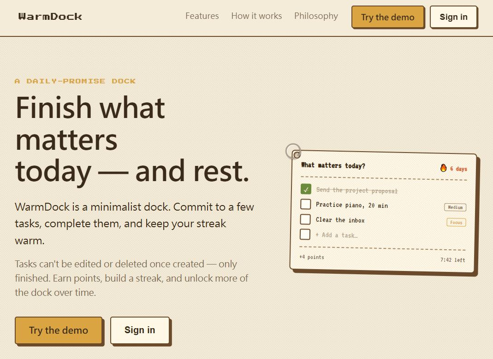
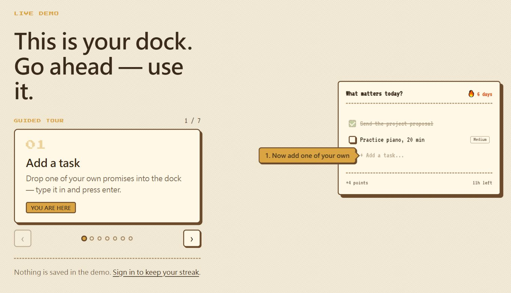
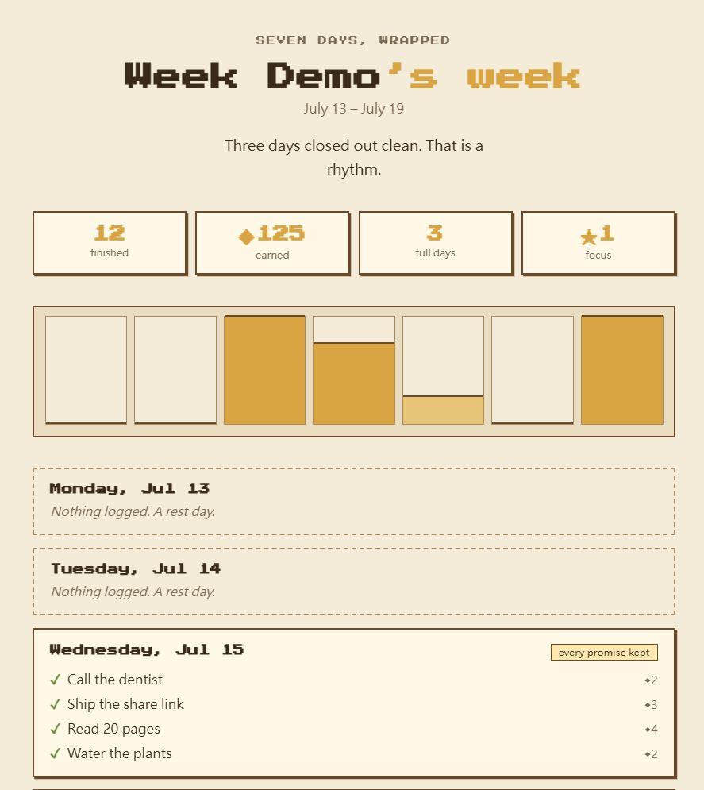

# WarmDock: Building a Daily-Promise Dock

WarmDock is a small productivity app built on one uncomfortable rule: **a task, once created, cannot be edited or deleted — only finished.** Everything else in the product follows from defending that rule.

**[Try the live app](https://warmdock.guagualab.com/)** · **[Try the demo without signing up](https://warmdock.guagualab.com/demo)**

## What is open here

This repository is a **write-up, not the source**. It documents the product thinking, the architecture, and the decisions behind WarmDock — the parts that are useful to read even if you never see the code.

- [Product concept](docs/product-concept.md) — the rule, the daily cycle, and why the app is shaped this way
- [Architecture](docs/architecture.md) — one backend, three clients, and the seams that keep them honest
- [Build journey](docs/build-journey.md) — the order things were actually built in, and what each phase cost
- [Decisions](docs/decisions.md) — the calls that were hard, including the ones I got wrong first

The application source stays private. This repository intentionally excludes source code, database migrations, prompts, credentials, environment values, and internal project identifiers.

## What WarmDock is

A day in WarmDock has a shape:

1. **Commit.** Drop in the few things that matter today. You start with three slots; more are earned, not given.
2. **Weigh.** A small language service (WarmAI) reads the wording, tidies typos, and proposes a difficulty from 1 to 5. You can override it.
3. **Finish.** Check tasks off. Completing them earns points and keeps a streak warm.
4. **Settle.** At your daily reset time the day is tallied and closed. Points land in your wallet. Unfinished tasks do not roll over — the day is over.

Points buy nodes on an **ability tree**: more task slots, a focus mode, a custom reset time, weekly analysis. The app you end up with is the one you paid for with completed work.

Every seven days after unlocking weekly analysis, a **gift box** appears in the corner with that week wrapped up — what you finished, day by day. You can share it as a public link, choosing which tasks appear, and turn the link off later.

## Where it runs

| Surface | State | Notes |
| --- | --- | --- |
| Web | Live | A plain web app — the whole product in a browser |
| Desktop | Beta | Tauri; the dock pins to the edge of the screen |
| Mobile | Early | Expo; its own native UI over the same backend |

All three share one account and one authoritative backend.

## Screenshots

| | |
| --- | --- |
|  |  |
| The landing page | The live demo — no sign-up, nothing saved |
|  |  |
| A week, wrapped | The public page a shared week produces |

## Related

- [warmai-build-journey](https://github.com/MichaelLu0220/warmai-build-journey) — the same treatment for WarmAI, the task-understanding service WarmDock calls.

## License

MIT — see [LICENSE](LICENSE). The license covers the writing in this repository, not the WarmDock application.
