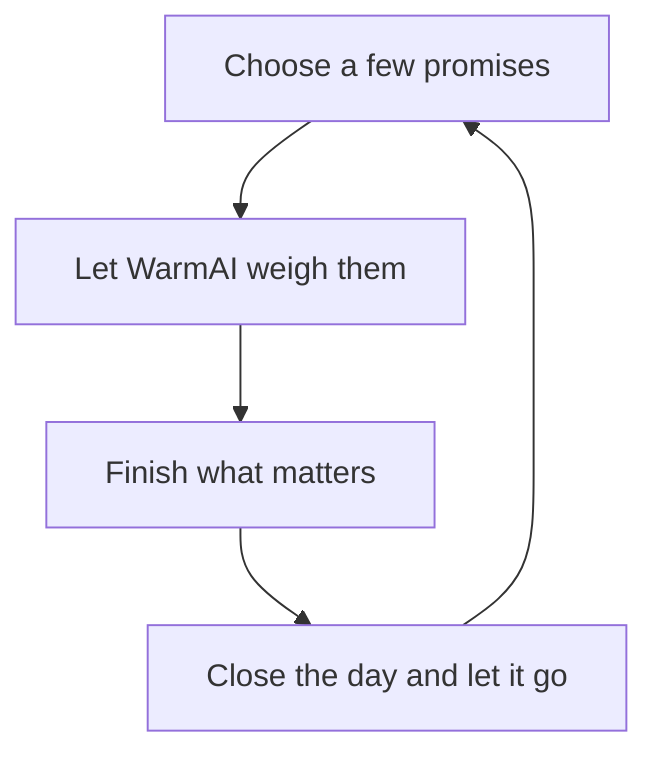
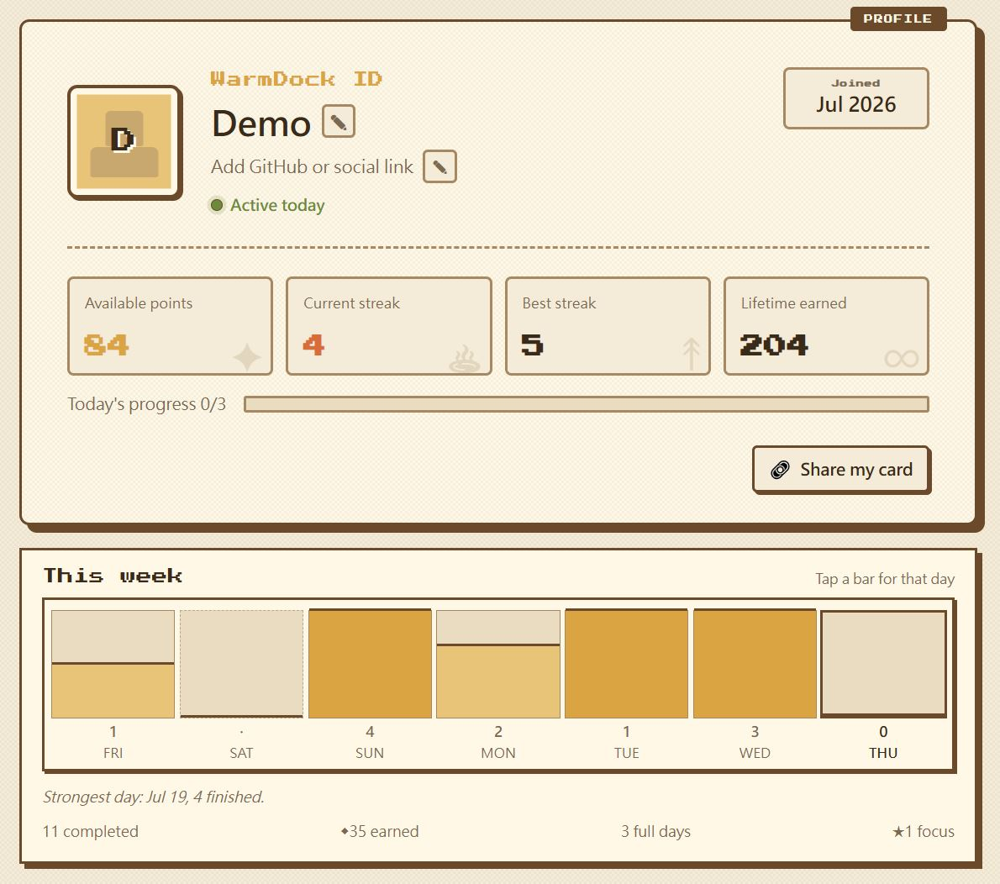
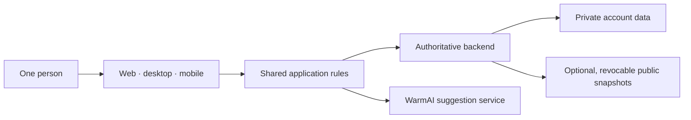

# WarmDock — A todo app where promises can't be undone.

[](https://warmdock.guagualab.com/)
[](https://github.com/MichaelLu0220/warmdock-build-journey/actions/workflows/ci.yml)
[](https://nodejs.org/)
[](LICENSE)

Most todo apps help you organize work. **WarmDock helps you keep promises.**

Once you commit to a task, it can't be edited, deleted, or quietly pushed into
tomorrow. It can only be finished.

That single rule changes everything.

**[Visit WarmDock](https://warmdock.guagualab.com/)** ·
**[Try the no-sign-up demo](https://warmdock.guagualab.com/demo)**


> This is the **public build journal** for WarmDock — the product thinking,
> architecture, and decisions, plus a runnable interaction demo. It does not
> contain the production application source. See the
> [repository boundary](#repository-boundary) for exactly what is and isn't here.

## Features

- **Promise-based tasks** — a committed task can only be finished, never edited or deleted.
- **AI-assisted difficulty** — a small service reads each task and proposes a 1–5 weight.
- **Weekly gift review** — every seventh day arrives as a gift box, not a dashboard.
- **Shareable progress** — publish a week or a profile card as a revocable link.
- **Progressive unlocks** — spend earned points on an ability tree, not a settings menu.
- **Cross-platform** — one backend behind web, desktop, and mobile.

## Tech stack

| Layer | Built with |
| --- | --- |
| Web | Next.js · React |
| Desktop | Tauri |
| Mobile | Expo · React Native |
| Backend | Supabase — Postgres, row-level security, stored procedures |
| AI service | FastAPI (WarmAI) |

## What makes WarmDock different?

It refuses to become a project manager:

- no backlog archaeology;
- no Sunday-afternoon tag gardening;
- no dragging "call the dentist" into a sixth consecutive tomorrow;
- no red badge shouting that you are 47 tasks behind.

You start with a small number of task slots. Finishing promises earns points;
points unlock more room, focus tools, a personal reset rhythm, and weekly
review. Progress doesn't inflate a number for decoration — it changes the shape
of the app.

And the week arrives as a gift, not a dashboard:

> The first weekly review was technically correct. Nobody cared. So I threw it away.
>
> The replacement became a small gift box. Open it. Unwrap your week. Keep it
> private, or share only what you choose.

## Interaction loop



## Screenshots

Built with the same warm, pixel-art design language across web, desktop, and
mobile.

| Landing page | Live demo |
| --- | --- |
|  |  |
| The idea before the interface | The real loop, backed by temporary in-memory data |

| Weekly review | Personal card |
| --- | --- |
|  |  |
| Seven days, wrapped | A public-safe snapshot of progress |

## Playground

`npm run demo` opens an interactive, warm pixel **book of cards you drag to
turn** — the WarmDock interaction rebuilt from small, dependency-free
utilities. No backend, no product source.

```bash
git clone https://github.com/MichaelLu0220/warmdock-build-journey.git
cd warmdock-build-journey

npm test            # run the utility tests
npm run demo        # interactive browser demo
npm run demo:print  # or just print the utility outputs
```

Requires Node.js 20 or newer. Nothing to install.

### Public utilities

| Function | What it decides |
| --- | --- |
| `classifyPageTurn` | whether a drag is a page turn, and which way |
| `dragPreview` | how far the card tilts mid-drag, and when release commits |
| `steppedFrames` | the pixel-stepped animation frames |
| `turnBook` | the current card, clamped at the covers |
| `closingLine` | a calm end-of-day line — tone expressed as data |

These were recreated for this repository. They demonstrate interaction ideas
without exposing production components or business rules.

## Architecture

Every client shares the same product rules. Only data storage changes.



The backend is authoritative: every state change goes through a stored
procedure, and the client cannot award itself points or edit a finished task —
because the product *is* its constraints. The full note, at the level of
boundaries and trade-offs, is in
[docs/architecture.md](docs/architecture.md).

## Five things I changed my mind about

The first version was cheap. The expensive part was learning where the product
metaphor stopped working:

1. A desktop dock made sense; a browser overlay did not. The web version became a normal web page.
2. A 24-pixel page-turn edge felt precise with a mouse and hostile under a thumb.
3. "Debounced AI" still made too many calls for a slow typist — the useful event was *finishing* the edit, not pausing between letters.
4. A weekly chart had the right numbers and created no desire to return. Timing and presentation mattered more than another metric.
5. Sharing productivity data sounds harmless until a task title says "call the oncologist." Privacy had to be part of the interaction, not a footnote.

The longer story is in [docs/build-journey.md](docs/build-journey.md) and
[docs/decisions.md](docs/decisions.md).

## Read the notebook

- [Product concept](docs/product-concept.md) — the rule, the daily cycle, the ability tree
- [Architecture](docs/architecture.md) — one backend, three clients, and the seams that keep them honest
- [Build journey](docs/build-journey.md) — the order things were actually built in
- [Decisions](docs/decisions.md) — the hard calls, including the ones I got wrong first

## Repository boundary

| ✅ Public | ❌ Private |
| --- | --- |
| Product decisions and reasoning | Production application source |
| A high-level system map | Database schema, migrations, policies |
| Screenshots of public surfaces | Credentials, environment values, deploy config |
| Runnable interaction demo + utilities | Model prompts, datasets, provider adapters |
| Tests for those utilities | Logs, backups, and user data |

Full detail — and how to report anything private that slips through — is in
[SECURITY.md](SECURITY.md).

## Ecosystem

- **[WarmDock](https://warmdock.guagualab.com/)** — the daily-promise app (this write-up).
- **[WarmAI](https://github.com/MichaelLu0220/warmai-build-journey)** — the task-understanding service behind it, with its own public toolkit.

## License

The writing, examples, and playground in this repository are available under the
[MIT License](LICENSE). The private WarmDock application is not included or
licensed by this repository.
