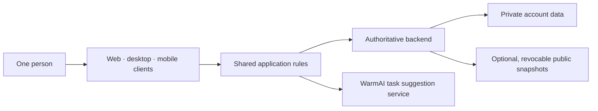

# WarmDock: a todo app that will not negotiate with you

[](https://warmdock.guagualab.com/)
[](https://nodejs.org/)
[](LICENSE)

Most todo apps are excellent places to move the same task into tomorrow.

WarmDock is built around a less comfortable idea: **after a task becomes a
promise, it cannot be edited or deleted. It can only be finished.**

That is the whole product in one sentence. The rest is what happened when I
tried to make that sentence kind enough to use every day.

**[Visit WarmDock](https://warmdock.guagualab.com/)** ·
**[Try the no-sign-up demo](https://warmdock.guagualab.com/demo)**


## First: what did I actually open?

This is the **building diary and public playground**, not a mirror of the
production repository.

| You will find | You will not find |
| --- | --- |
| Product rules and the thinking behind them | Production application source |
| A high-level system map | Database schema or migrations |
| Mistakes, reversals, and lessons | Credentials, environment values, or deployment config |
| Product screenshots | Private prompts, datasets, logs, or user data |
| Small, runnable UI utilities | Internal APIs or business-rule implementations |

The little source package in this repo is the museum gift shop, not the engine
room. It contains page-turn gesture math, pixel-style stepped motion, and a
sample “warm, never nagging” copy system.

## The loop

```text
choose a few promises
        ↓
let WarmAI suggest their weight
        ↓
finish what matters
        ↓
close the day and let it go
```

WarmDock deliberately does not become a project manager:

- no backlog archaeology;
- no Sunday afternoon tag gardening;
- no dragging “call the dentist” into a sixth consecutive tomorrow;
- no red badge shouting that you are now 47 tasks behind.

You begin with a small number of task slots. Finishing promises earns points;
points unlock more room, focus tools, a personal reset rhythm, and weekly
review. Progress does not make the number bigger just for decoration—it changes
the shape of the app.

## A week arrives as a gift, not a dashboard

A correct bar chart can still be a terrible feature.

The first weekly review was technically fine and emotionally invisible. The
version that stayed became a small gift box: open it to unwrap the week, keep it
private, or publish a revocable link with only the task titles you choose.

That change taught me a useful rule:

> Data becomes a product feature when it arrives at the right moment.

## Screenshots

| Landing page | Live demo |
| --- | --- |
|  |  |
| The idea before the interface | The real interaction loop, backed by temporary in-memory data |

| Weekly review | Personal card |
| --- | --- |
|  |  |
| Seven days, wrapped | A small public-facing snapshot of progress |

## The safe-to-open playground

Requires Node.js 20 or newer and has no runtime dependencies.

```bash
git clone https://github.com/MichaelLu0220/warmdock-build-journey.git
cd warmdock-build-journey

npm test
npm run demo
```

```js
import { classifyPageTurn, steppedFrames } from "./src/index.js";

classifyPageTurn({
  deltaX: -92,
  deltaY: 18,
  pointer: "touch",
});
// "next"

steppedFrames({ from: 0, to: 1, steps: 4 });
// [0, 0.25, 0.5, 0.75, 1]
```

These utilities were recreated for this public repository. They demonstrate
interaction ideas without exposing production components or business logic.

## What took the longest

Not the first version. The expensive part was discovering where the product
metaphor stopped working:

1. A desktop dock made sense; a browser overlay did not. The web version became
   a normal web page.
2. A 24-pixel page-turn edge worked with a mouse and felt hostile under a thumb.
3. “Debounced AI” still made too many calls for a slow typist. The useful event
   was finishing the edit, not pausing between letters.
4. A weekly chart contained the right information and created no desire to
   return. Timing and presentation mattered more than another metric.
5. Sharing productivity data sounds harmless until a task title says “call the
   oncologist.” Privacy needed to be part of the interaction, not a footnote.

The longer version lives in [the build journey](docs/build-journey.md).

## The deliberately boring system map



The public architecture note stays at the level of boundaries and trade-offs.
Names of private services, schemas, routes, and operational controls stay in the
private repository.

## Read the notebook

- [Product concept](docs/product-concept.md)
- [Build journey](docs/build-journey.md)
- [Architecture without the secret floor plan](docs/architecture.md)
- [Decisions and reversals](docs/decisions.md)
- [Public-release boundary](SECURITY.md)

## Related

[warmai-build-journey](https://github.com/MichaelLu0220/warmai-build-journey)
documents the small task-understanding service behind WarmDock and includes a
separate public toolkit.

## License

The writing, examples, and public playground in this repository are available
under the [MIT License](LICENSE). The private WarmDock application is not
included or licensed by this repository.

