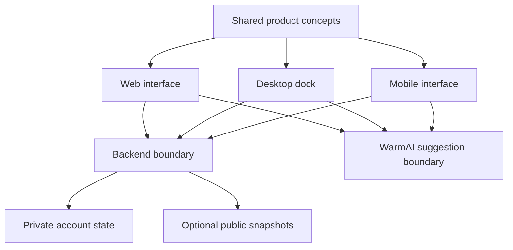

# Architecture without the secret floor plan

This page describes boundaries and trade-offs. It intentionally does not name
private routes, tables, procedures, providers, infrastructure, or environment
configuration.

## One product, several surfaces

WarmDock runs as a web app, a desktop dock, and an early mobile client. They
share the product model and talk to one authoritative backend, while each
platform is allowed to behave like itself.

## Dependency direction

The reusable product concepts do not import a platform. Interfaces can depend
on shared ideas; shared ideas do not depend on Next.js, Tauri, Expo, a browser,
or a database client.

That direction buys three practical things:

- another platform can reuse behavior without copying a screen;
- tests can exercise decisions without starting the whole product;
- the public demo can replace account-backed services with temporary memory.

## The backend owns consequences

Clients may predict what an action will look like, but the backend decides what
actually happened. This matters for points, unlocks, daily settlement, and any
rule whose violation would change the meaning of the product.

This document stops there on purpose. Enforcement mechanisms, data structures,
authorization controls, and operational procedures belong to the private
system.

## AI is optional, server-mediated assistance

WarmAI suggests wording and weight; it does not own task creation. The basic
flow survives when the suggestion service is slow or unavailable.

Private credentials do not belong in a client application. The public
repository documents the boundary without publishing the production adapter or
configuration.

## Public sharing uses a smaller data shape

A share page is not a public view of a private account. It is a deliberately
smaller representation with an independent lifecycle:

- created only by an explicit action;
- contains only allowed fields;
- can omit sensitive titles;
- can be revoked;
- avoids implying that hidden information does not exist.

## Aesthetic constraints are still architecture

WarmDock uses warm paper colours, hard pixel shadows, and stepped movement.
Those choices affect text length, gesture handling, motion helpers, and
accessibility—not just CSS.

The public `src/` package explores three of these non-core edges. It contains no
authentication, storage, scoring, unlock, or task-enforcement code.

